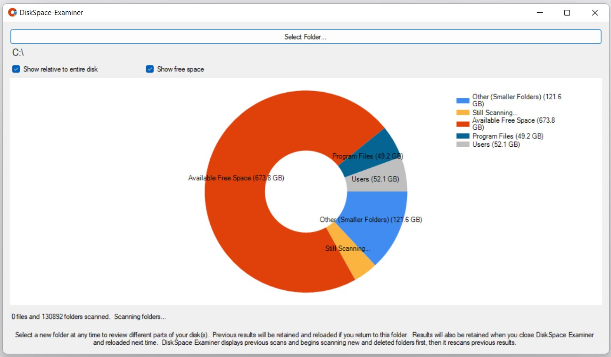

# DiskSpace-Examiner
A Windows application that shows what folders are using disk space as a pie chart.  (C#)

This is a simple tool providing a GUI where you can see where your disk space is being used.  You are asked to select a disk or folder.  DiskSpace-Examiner then begins scanning the selected location.  It displays a pie chart as it goes, allowing you to see where your space is being used.  An example:

You can click on the "Select Folder..." button to start examining a new location.  The new location might be a folder within the current one because you want to see more detail.  In this example, you might want to click "Select Folder..." and look at the "C:\Users" directory, because most of the disk usage is there and you'd like to see a pie chart of the different users.

DiskSpace-Examiner keeps a record of the scan as it goes so that if you return to view the disk space usage of a location again it will quickly show you the pie chart as it was.  It will automatically start an "update scan" at that point where it works to find updates since the lsat time the location was scanned.  This makes it quick to use the "Select Folder..." button and move around in different directories.
